# wJS

* [What is wJS?](#what-is-wjs)
* [Examples](#examples)
    * [Namespaces](#namespaces)
        * [Example of namespace definition](#example-of-namespace-definition)
        * [Example of namespace population](#example-of-namespace-population)
    * [Add a namespace to an existing namespace](#add-a-namespace-to-an-existing-namespace)
        * [Example of namespace in namespace](#example-of-namespace-in-namespace)
        * [Example of adding members to nested namespace](#example-of-adding-members-to-nested-namespace)
    * [Creating a class](#creating-a-class)
        * [Example of class Robot](#example-of-class-robot)
        * [Example of class Car](#example-of-class-car)
        * [Example of class Person](#example-of-class-person)
    * [Deriving a class](#deriving-a-class)
        * [Example of classes MechanicalCar and ElectricCar](#example-of-classes-mechanicalcar-and-electriccar)
        * [Example of class Employee](#example-of-class-employee)
    * [Create mixins](#create-mixins)
        * [Example of class HybridCar](#example-of-class-hybridcar)
    * [Manage events](#manage-events)
        * [Example of adding event management functionality to the class Person](#example-of-adding-event-management-functionality-to-the-class-person)
        * [Example of defining event in the class Person](#example-of-defining-event-in-the-class-person)
        * [Example of adding event handler](#example-of-adding-event-handler)
        * [Example of dispatching an event in the class Person](#example-of-dispatching-an-event-in-the-class-person)
        * [Example of removing event handler](#example-of-removing-event-handler)
        * [Example of marking an event handler function as being compatible with declarative processing](#example-of-marking-an-event-handler-function-as-being-compatible-with-declarative-processing)
    * [Binding](#binding)
        * [Example of creating bindable list](#example-of-creating-bindable-list)
        * [Example of binding the data properties of the business object to HTML elements on the UI](#example-of-binding-the-data-properties-of-the-business-object-to-html-elements-on-the-ui)
        * [Example of creating observable constructor](#example-of-creating-observable-constructor)
    * [Controls](#controls)
        * [Example of creating a Rating control](#example-of-creating-a-rating-control)
        * [Example of creating a ToggleSwitch control](#example-of-creating-a-toggleswitch-control)
        * [Example of creating a DatePicker control](#example-of-creating-a-datepicker-control)
        * [Example of creating a TimePicker control](#example-of-creating-a-timepicker-control)
        * [Example of creating a Tooltip control](#example-of-creating-a-tooltip-control)
        * [Example of creating a Repeater control](#example-of-creating-a-repeater-control)
        * [Example of creating a FlipView control](#example-of-creating-a-flipview-control)
        * [Example of creating a ListView control](#example-of-creating-a-listview-control)
        * [Example of filtering items in the ListView control](#example-of-filtering-items-in-the-listview-control)
        * [Example of grouping items in the ListView control](#example-of-grouping-items-in-the-listview-control)
        * [Example of viewing data at two different zoom levels](#example-of-viewing-data-at-two-different-zoom-levels)
        * [Example of placing commands in the appbar](#example-of-placing-commands-in-the-appbar)
        * [Example of placing commands in the toolbar](#example-of-placing-commands-in-the-toolbar)
    * [Network](#network)
        * [Example of Connecting to URL](#example-of-connecting-to-url)

What is wJS?
-----------------

wJS is a collection of frequently used functions for WinJS apps.

Examples
-----------------

### Namespaces ###

#### Example of namespace definition: ####

```js
// Define the namespace ProgrammingLanguages and create the JavaScript under it.
W.nsDef("ProgrammingLanguages", {
    JavaScript: {
        getDescription: function () {
            return 'JavaScript is the programming language of HTML and the Web.';
        }
    }
});
console.log(ProgrammingLanguages.JavaScript.getDescription());
```

#### Example of namespace population: ####

```js
// Define the namespace ProgrammingLanguages.
W.nsDef("ProgrammingLanguages");

// JavaScript created in the ProgrammingLanguages namespace.
ProgrammingLanguages.JavaScript = {
    getDescription: function () {
        return 'JavaScript is the programming language of HTML and the Web.';
    }
};
console.log(ProgrammingLanguages.JavaScript.getDescription());
```

### Add a namespace to an existing namespace ###

#### Example of namespace in namespace: ####

```js
W.nsDefChild(ProgrammingLanguages, "CLI", {
    Bash: {
        getDescription: function () {
            return "Bash is the shell, or command language interpreter, for the GNU operating system.";
        }
    }
});
console.log(ProgrammingLanguages.CLI.Bash.getDescription());
```

#### Example of adding members to nested namespace: ####

```js
W.nsDefChild(ProgrammingLanguages, "CLI");
ProgrammingLanguages.CLI.Bash = {
    getDescription: function () {
        return "Bash is the shell, or command language interpreter, for the GNU operating system.";
    }
};
console.log(ProgrammingLanguages.CLI.Bash.getDescription());
```

### Creating a class ###

#### Example of class Robot: ####

```js
var Robot = W.clsDef(function (name) {
        this.name = name;
    }, {
        modelName: "",
        on: function () { },
        off: function () { }
    }, {
        harmsHumans: false,
        getModels: function () { return ["R2-D2", "WALL-E", "Bender"]; }
    }),
    models = Robot.getModels(),
    r = new Robot("Artoo-Detoo");
r.model = "R2-D2";
r.on();
Robot.harmsHumans = false;
console.log(models);
```

#### Example of class Car: ####

```js
var Car = W.clsDef(function (model) {
        this.model = model;
    }, {
        _model: undefined,
        model: {
            set: function (value) { this._model = value; },
            get: function () { return this._model; }
        }
    });
```

#### Example of class Person: ####

```js
var Person = W.clsDef(function (firstName, lastName) {
        this.firstName = firstName;
        this.lastName = lastName;
    }, {
        _firstName: undefined,
        _lastName: undefined,
        firstName: {
            set: function (value) { this._firstName = value; },
            get: function () { return this._firstName; }
        },
        lastName: {
            set: function (value) { this._lastName = value; },
            get: function () { return this._lastName; }
        }
    }),
    ag = new Person("Abbas", "Gussenov");
console.log(ag.firstName + ' ' + ag.lastName);
```

### Deriving a class ###

#### Example of classes MechanicalCar and ElectricCar: ####

```js
var MechanicalCar = W.clsDefChild(Car, function (model, fuelTank) {
        this.model = model;
        this.fuelTank = fuelTank;
    }, {
        _fuelTank: undefined,
        fuelTank: {
            set: function (value) { this._fuelTank = value; },
            get: function () { return this._fuelTank; }
        }
    }),

    ElectricCar = W.clsDefChild(Car, function (model, batteryType) {
        this.model = model;
        this.batteryType = batteryType;
    }, {
        _batteryType: undefined,
        batteryType: {
            set: function (value) { this._batteryType = value; },
            get: function () { return this._batteryType; }
        }
    });
```

#### Example of class Employee: ####

```js
var Employee = W.clsDefChild(Person, function (firstName, lastName, position, hireDate) {
        this.firstName = firstName;
        this.lastName = lastName;
        this.position = position;
        this.hireDate = hireDate;
    }, {
        _hireDate: undefined,
        _position: undefined,
        hireDate: {
            set: function (value) { this._hireDate = value; },
            get: function () { return this._hireDate; }
        },
        position: {
            set: function (value) { this._position = value; },
            get: function () { return this._position; }
        },
        getDescription: function () {
            var options = { day: 'numeric', month: 'long', year: 'numeric' };
            return this.firstName + " " + this.lastName
                + " was hired as a " + this.position
                + " on the " + this.hireDate.toLocaleString("en-US", options) + ".";
        }
    }),
    ag = new Employee("Abbas", "Gussenov", "software developer", new Date(2016, 8, 20));
console.log(ag.getDescription());
```

### Create mixins ###

#### Example of class HybridCar: ####

```js
var HybridCar = W.clsMix(function (model, fuelTank, batteryType) {
        this.model = model;
        this.fuelTank = fuelTank;
        this.batteryType = batteryType;
    }, MechanicalCar, ElectricCar),

    c = new HybridCar("Toyota Prius 2016", 43, "NiMH");

console.log("Specs for " + c.model
    + "\nBattery type: " + c.batteryType
    + "\nFuel tank: " + c.fuelTank + " l");
```

### Manage events

#### Example of adding event management functionality to the class Person: ####

```js
W.evtMgmtAdd(Person);
```

#### Example of defining event in the class Person: ####

```js
W.evtDef(Person, "WeightChanged");
```

#### Example of adding event handler: ####

```js
var myPerson = new Person(64),
    listener = function (evt) {
        console.log("WeightChanged event fired!");
        console.log(myPerson.weight);
    };
W.evtHndAdd(myPerson, "WeightChanged", listener);
myPerson.weight += 1;
myPerson.weight -= 1;
```

#### Example of dispatching an event in the class Person: ####

```js
var Person = W.clsDef(function (weight) {
        this.weight = weight;
    }, {
        _weightValue: undefined,
        weight: {
            get: function () {
                return this._weightValue;
            },
            set: function (val) {
                this._weightValue = val;
                W.evtRaise(this, "WeightChanged");
            }
        }
    });
```

#### Example of removing event handler: ####

```js
W.evtHndDel(myPerson, "WeightChanged", listener);
myPerson.weight = 90;
```

#### Example of marking an event handler function as being compatible with declarative processing: ####

<kbd>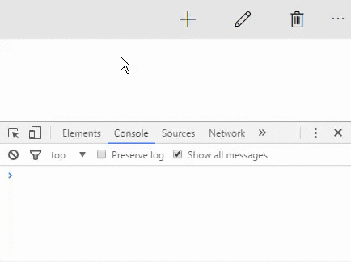</kbd>

```html
<body class="win-type-body">
    <div class="basicToolbar" data-win-control="WinJS.UI.ToolBar">
        <!-- Primary commands -->
        <button data-win-control="WinJS.UI.Command" data-win-options="{ id: 'cmdAdd',    label: 'Add',    section: 'primary', type: 'button', icon: 'add',    onclick: cmd.click }"></button>
        <button data-win-control="WinJS.UI.Command" data-win-options="{ id: 'cmdEdit',   label: 'Edit',   section: 'primary', type: 'button', icon: 'edit',   onclick: cmd.click }"></button>
        <button data-win-control="WinJS.UI.Command" data-win-options="{ id: 'cmdDelete', label: 'Delete', section: 'primary', type: 'button', icon: 'delete', onclick: cmd.click }"></button>
        <!-- Secondary command -->
        <button data-win-control="WinJS.UI.Command" data-win-options="{ id: 'cmdShare', label: 'Share', section: 'secondary', type: 'button', onclick: cmd.click }"></button>
    </div>
    <script>
        (function () {
            'use strict';
            W.nsDef("cmd", {
                click: W.evtHndMark(function (e) {
                    var t = e.currentTarget;
                    if (t.winControl) {
                        console.log(t.winControl.label);
                    }
                })
            });
            W.uiCtrlRender();
        }());
    </script>        
</body>
```

### Binding ###

#### Example of creating bindable list ####

<kbd>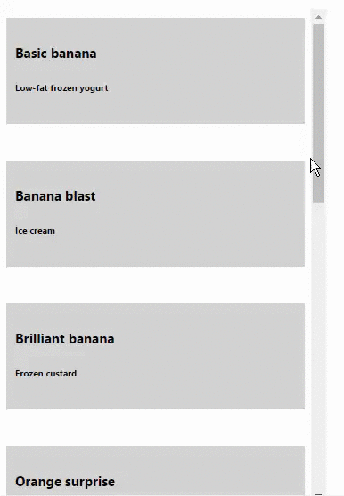</kbd>

```html
<head>
    <style>
        #basicListView { height: 100%; margin-top: 10px; margin-right: 20px; }
        #templateContainer { display: -ms-grid; -ms-grid-columns: 1fr; min-height: 150px; }
        #itemContainer { background-color: lightgray; width: 100%; padding: 10px; }
    </style>
</head>
<body class="win-type-body">
    <div id="flavorItemTemplate" data-win-control="WinJS.Binding.Template">
        <div id="templateContainer">
            <div id="itemContainer">
                <h4 data-win-bind="innerText: title"></h4>
                <h6 data-win-bind="innerText: text"></h6>
            </div>
        </div>
    </div>
    <div id="basicListView" data-win-control="WinJS.UI.ListView"
         data-win-options="{ itemDataSource: DataExample.flavorList.dataSource,
                             itemTemplate: select('#flavorItemTemplate'),
                             selectionMode: 'none',
                             layout: { type: WinJS.UI.ListLayout } }">
    </div>
    <script>
        (function () {
            'use strict';
            var flavors = [{ title: "Basic banana", text: "Low-fat frozen yogurt" },
                { title: "Banana blast", text: "Ice cream" },
                { title: "Brilliant banana", text: "Frozen custard" },
                { title: "Orange surprise", text: "Sherbet" },
                { title: "Original orange", text: "Sherbet" },
                { title: "Vanilla", text: "Ice cream" },
                { title: "Very vanilla", text: "Frozen custard" },
                { title: "Marvelous mint", text: "Gelato" },
                { title: "Succulent strawberry", text: "Sorbet" }],
                flavorList = W.bndLstNew(flavors);
            W.nsDef("DataExample", { flavorList: flavorList });
            W.uiCtrlRender();
        }());
    </script>
</body>
```

#### Example of binding the data properties of the business object to HTML elements on the UI ####

<kbd>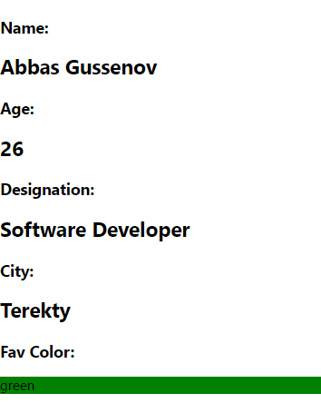</kbd>

```html
<body class="win-type-body">
    <div id="container">
        <h3>Name:</h3>
        <h2><span data-win-bind="innerText: name"></span></h2>
        <h3>Age:</h3>
        <h2><span data-win-bind="innerText: age"></span></h2>
        <h3>Designation:</h3>
        <h2><span data-win-bind="innerText: designation"></span></h2>
        <h3>City:</h3>
        <h2><span data-win-bind="innerText: city"></span></h2>
        <h3>Fav Color:</h3>
        <div data-win-bind="style.background: favcolor">
            <div class="favcolor" data-win-bind="innerText: favcolor"></div>
        </div>
    </div>
    <script>
        (function () {
            'use strict';
            var person = {
                    name: "Abbas Gussenov",
                    age: 26,
                    designation: "Software Developer",
                    city: "Terekty",
                    favcolor: "green"
                };
            W.bndDat2El('container', person);
        }());
    </script>
</body>
```

#### Example of creating observable constructor ####

<kbd>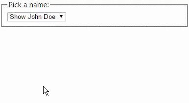</kbd>

```html
<body class="win-type-body">
    <div id="templateDiv" data-win-control="WinJS.Binding.Template">
        <div class="templateItem" data-win-bind="style.background: color" style="color: white">
            <ol>
                <li><span>Name: </span><span data-win-bind="textContent: name"></span></li>
                <li><span>Birthday: </span><span data-win-bind="textContent: birthday"></span></li>
                <li><span>Pet's name: </span><span data-win-bind="textContent: petname"></span></li>
                <li><span>Dessert: </span><span data-win-bind="textContent: dessert"></span></li>
            </ol>
        </div>
    </div>
    <div id="renderDiv"></div>
    <fieldset id="templateControlObject">
        <legend>Pick a name:</legend>
        <select id="templateControlObjectSelector">
            <option value="0">Show John Doe</option>
            <option value="1">Show Jane Dow</option>
            <option value="2">Show Jake Doe</option>
        </select>
    </fieldset>
    <script>
        (function () {
            'use strict';
            var Person = W.bndClsNew({ name: "", color: "", birthday: "", petname: "", dessert: "" }),
                people = [
                    new Person({ name: "John Doe", color: "red", birthday: "2/2/2002", petname: "Spot", dessert: "chocolate cake" }),
                    new Person({ name: "Jane Doe", color: "green", birthday: "3/3/2003", petname: "Xena", dessert: "cherry pie" }),
                    new Person({ name: "Jake Doe", color: "blue", birthday: "2/2/2002", petname: "Pablo", dessert: "ice cream" })
                ],
                selector;
            function handleChange(evt) {
                var templateElement = document.querySelector("#templateDiv"),
                    renderElement = document.querySelector("#renderDiv"),
                    selected = evt.target.selectedIndex,
                    templateControl = templateElement.winControl;
                renderElement.innerHTML = "";
                templateElement.winControl.render(people[selected], renderElement);
            }
            selector = document.querySelector("#templateControlObjectSelector");
            W.evtHndAdd(selector, "change", handleChange, false);
            W.uiCtrlRender();
        }());
    </script>
</body>
```

### Controls ###

#### Example of creating a Rating control: ####

<kbd>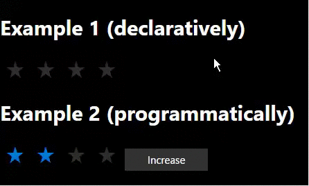</kbd>

```html
<body class="win-type-body">
    <h1>Example 1 (declaratively)</h1>
    <div data-win-control="WinJS.UI.Rating" data-win-options="{ maxRating: 4, enableClear: false }"></div>
    <h1>Example 2 (programmatically)</h1>
    <div id="rating"></div>
    <button class="action win-button" id="btnInc" type="button">Increase</button>
    <script>
        (function () {
            'use strict';
            W.uiCtrlRender();
            var ratingCtrl = W.uiCtrlRatingNew();
            W.evtHndAdd(document.getElementById("btnInc"), "click", function () {
                var ratingControl = W.uiCtrlGet("rating");
                ratingControl.userRating += 1;
            });
        }());
    </script>
</body>
```

#### Example of creating a ToggleSwitch control: ####

<kbd>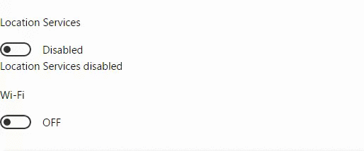</kbd>

```html
<body class="win-type-body">                
    <div id="locationServices"></div>
    <div id="info"></div>                
    <div data-win-control="WinJS.UI.ToggleSwitch" 
         data-win-options="{title :'Wi-Fi', labelOff: 'OFF', labelOn:'ON', checked:true}">
    </div>
    <script>
        (function () {
            'use strict';

            var toggleBtn,
                infoEl;

            function chgEvtHnd(args) {
                if (toggleBtn.checked) {
                    infoEl.innerHTML = 'Location Services enabled';
                } else {
                    infoEl.innerHTML = 'Location Services disabled';
                }
            }

            W.uiCtrlRender(function () {
                toggleBtn = W.uiCtrlToggleNew('locationServices', 'Location Services', 'Disabled', 'Enabled', true, chgEvtHnd);
                infoEl = document.getElementById('info');
            });

        }());
    </script>
</body>
```

#### Example of creating a DatePicker control: ####

<kbd>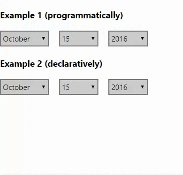</kbd>

```html
<body class="win-type-body">
    <h3>Example 1 (programmatically)</h3>
    <div id="birthday"></div>
    <div id="info"></div>
    <h3>Example 2 (declaratively)</h3>
    <div data-win-control="WinJS.UI.DatePicker"
         data-win-options="{ monthPattern: '{month.abbreviated}', 
                              datePattern: '{day.integer(2)}', 
                              yearPattern: '{year.abbreviated}' }">
    </div>
    <script>
        (function () {
            'use strict';
            var datePick, infoEl = document.getElementById("info");
            W.uiCtrlRender();
            datePick = new W.uiCtrlDateNew("birthday", function (args) {
                infoEl.innerHTML = "The selected date is " + datePick.current.toDateString();
            }, '{month.abbreviated}', '{day.integer(2)}', '{year.abbreviated}');
        }());
    </script>
</body>
```

#### Example of creating a TimePicker control: ####

<kbd>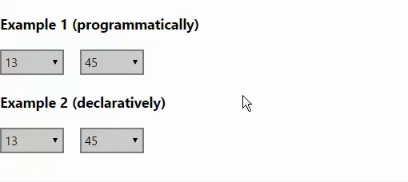</kbd>

```html
<body class="win-type-body">
    <h3>Example 1 (programmatically)</h3>
    <div id="timeSelector"></div>        
    <div id="info"></div>        
    <h3>Example 2 (declaratively)</h3>
    <div data-win-control="WinJS.UI.TimePicker" 
         data-win-options="{ clock: '24HourClock', minuteIncrement: 15 }">
    </div>
    <script>
        (function () {
            'use strict';
            var timePick, infoEl = document.getElementById("info");
            W.uiCtrlRender();
            timePick = new W.uiCtrlTimeNew("timeSelector", function (args) {
                infoEl.innerHTML = "The selected time is " + timePick.current.toTimeString();
            }, '24HourClock', 15, 'Hour: {hour.integer(2)}', 'Min: {minute.integer(2)}', '{period.abbreviated(2)}');
        }());
    </script>
</body>
```

#### Example of creating a Tooltip control: ####

<kbd></kbd>

```html
<head>
    <style>
        .win-tooltip
        {
            background-color: bisque;
            border-radius:30px;
            border-color:red;
        }
    </style>
</head>
<body class="win-type-body">
    <button id="btnSave" class="action win-button">Save</button>
    <button data-win-control="WinJS.UI.Tooltip" class="action win-button"
            data-win-options="{ innerHTML: 'Removes the <b>Employee</b> record' }">Remove</button>
    <script>
        (function () {
            'use strict';
            W.pageParsed(function () {
                var tooltip = W.uiCtrlTipNew("btnSave", 'Saves the <b>Employee</b> record');
                W.uiCtrlRender();
            });
        }());
    </script>
</body>
```

#### Example of creating a Repeater control: ####

<kbd>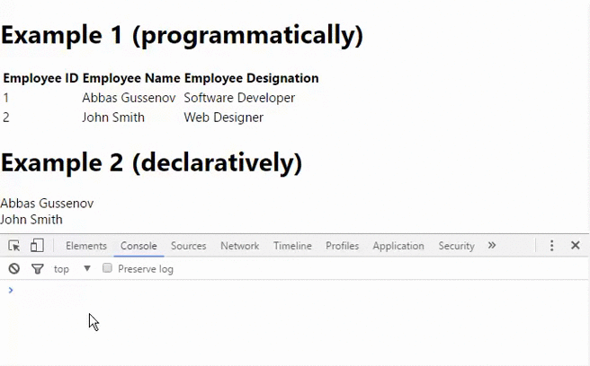</kbd>

```html
<body class="win-type-body">        
    <h1>Example 1 (programmatically)</h1>
    <table>
        <thead>
            <tr>
                <th>Employee ID</th>
                <th>Employee Name</th>
                <th>Employee Designation</th>
            </tr>
        </thead>
        <tbody id="repeaterData">
            <tr>
               <td data-win-bind="textContent:id"></td>
               <td data-win-bind="textContent:name"></td>
               <td data-win-bind="textContent:designation"></td>
            </tr>
        </tbody>
    </table>

    <h1>Example 2 (declaratively)</h1>
    <div id="repeaterData2" data-win-control="WinJS.UI.Repeater">
        <div data-win-control="WinJS.UI.ItemContainer" data-win-bind="dataset.name:name">
            <div data-win-bind="textContent:name"></div>
        </div>
    </div>

    <script>
        (function () {
            'use strict';
            var employees = W.bndLstNew([{ id: 1, name: "Abbas Gussenov", designation: "Software Developer" },
                    { id: 2, name: "John Smith", designation: "Web Designer" }]),
                repeaterControl1;
            repeaterControl1 = W.uiCtrlRepeaterNew("repeaterData");
            repeaterControl1.data = employees;

            W.uiCtrlRender(function () {
                var repeaterControl2 = document.getElementById('repeaterData2').winControl;
                repeaterControl2.data = employees;
                repeaterControl2.addEventListener("invoked", function (e) {
                    console.log(e.target.dataset.name);
                });
            });
        }());
    </script>
</body>
```

#### Example of creating a FlipView control: ####

<kbd>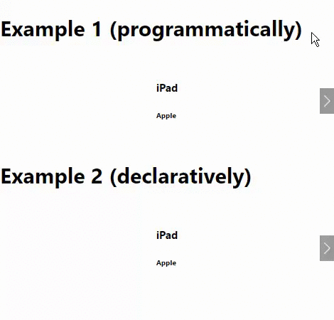</kbd>

```html
<body class="win-type-body">        
    <h1>Example 1 (programmatically)</h1>
    <div id="template">
        <div>
            <h4 data-win-bind="innerText: name"></h4>
            <h6 data-win-bind="innerText: vendor"></h6>
        </div>
    </div>
    <div id="flipView1" style="height: 128px;"></div>        
    <h1>Example 2 (declaratively)</h1>
    <div id="template2" data-win-control="WinJS.Binding.Template">
        <div>
            <h4 data-win-bind="innerText: name"></h4>
            <h6 data-win-bind="innerText: vendor"></h6>
        </div>
    </div>
    <div id="flipView2" style="height: 128px;" data-win-control="WinJS.UI.FlipView"
        data-win-options="{ itemTemplate: select('#template2'), itemDataSource: SampleData.Products.dataSource }">
    </div>
    <script>
        (function () {
            'use strict';
            var Products = W.bndLstNew([{ id: 1, name: "iPad", vendor: "Apple" },
                    { id: 2, name: "iPhone", vendor: "Apple" }]);
            W.nsDef("SampleData", {
                Products: Products
            });
            var template = W.bndTplNew("template"),
                flipView1 = W.uiCtrlFlipNew("flipView1", template, SampleData.Products);
            W.uiCtrlRender();
        }());
    </script>
</body>
```

#### Example of creating a ListView control: ####

<kbd>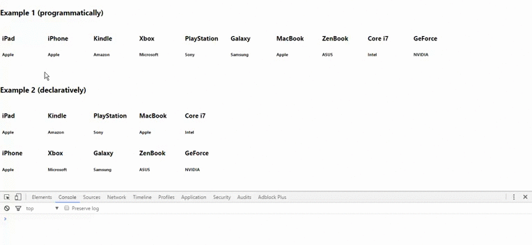</kbd>

```html
<body class="win-type-body">
    <h3>Example 1 (programmatically)</h3>
    <div id="template">
        <div style="height: 60px; width: 100px;">
            <h4 data-win-bind="innerText: name"></h4>
            <h6 data-win-bind="innerText: vendor"></h6>
        </div>
    </div>
    <div id="listView1" style="height: 128px;"></div>
    <h3>Example 2 (declaratively)</h3>
    <div id="template2" data-win-control="WinJS.Binding.Template">
        <div style="height: 60px; width: 100px;">
            <h4 data-win-bind="innerText: name"></h4>
            <h6 data-win-bind="innerText: vendor"></h6>
        </div>
    </div>
    <div data-win-control="WinJS.UI.ListView" style="height: 180px;"
        data-win-options="{ itemTemplate: select('#template2'), 
                            layout: { type: WinJS.UI.GridLayout, maximumRowsOrColumns: 5 },
                            itemDataSource: SampleData.Products.dataSource }">
    </div>
    <script>
        (function () {
            'use strict';
            var Products = W.bndLstNew([{ id: 1, name: "iPad", vendor: "Apple" },
                { id: 2, name: "iPhone", vendor: "Apple" },
                { id: 3, name: "Kindle", vendor: "Amazon" },
                { id: 4, name: "Xbox", vendor: "Microsoft" },
                { id: 5, name: "PlayStation", vendor: "Sony" },
                { id: 6, name: "Galaxy", vendor: "Samsung" },
                { id: 7, name: "MacBook", vendor: "Apple" },
                { id: 8, name: "ZenBook", vendor: "ASUS" },
                { id: 9, name: "Core i7", vendor: "Intel" },
                { id: 10, name: "GeForce", vendor: "NVIDIA" }]),
                listControl1, template;
            W.nsDef("SampleData", { Products: Products });
            template = W.bndTplNew("template");
            listControl1 = W.uiCtrlLstNew("listView1", "grid", template, SampleData.Products, 0);
            listControl1.addEventListener("iteminvoked", function (e) {
                var index = e.detail.itemIndex;
                e.detail.itemPromise.then(function (item) {
                    console.log(item.data.name);
                });
            });
            W.uiCtrlRender();
        }());
    </script>
</body>
```

#### Example of filtering items in the ListView control: ####

<kbd>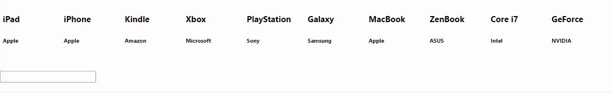</kbd>

```html
<body class="win-type-body">
    <div id="template">
        <div style="height: 60px; width: 100px;">
            <h4 data-win-bind="innerText: name"></h4>
            <h6 data-win-bind="innerText: vendor"></h6>
        </div>
    </div>
    <div id="listView1" style="height: 128px;"></div>
    <div><input id="txtSearch" /></div>
    <script>
        (function () {
            'use strict';
            var Products = W.bndLstNew([{ id: 1, name: "iPad", vendor: "Apple" },
                { id: 2, name: "iPhone", vendor: "Apple" },
                { id: 3, name: "Kindle", vendor: "Amazon" },
                { id: 4, name: "Xbox", vendor: "Microsoft" },
                { id: 5, name: "PlayStation", vendor: "Sony" },
                { id: 6, name: "Galaxy", vendor: "Samsung" },
                { id: 7, name: "MacBook", vendor: "Apple" },
                { id: 8, name: "ZenBook", vendor: "ASUS" },
                { id: 9, name: "Core i7", vendor: "Intel" },
                { id: 10, name: "GeForce", vendor: "NVIDIA" }]),
                listControl1, template, filterText;
            W.nsDef("SampleData", { Products: Products });
            template = W.bndTplNew("template");
            listControl1 = W.uiCtrlLstNew("listView1", "grid", template, SampleData.Products, 0);
            listControl1.addEventListener("iteminvoked", function (e) {
                var index = e.detail.itemIndex;
                e.detail.itemPromise.then(function (item) {
                    console.log(item.data.name);
                });
            });
            filterText = document.getElementById('txtSearch');
            filterText.addEventListener("keyup", function () {
                W.uiCtrlLstFilter(listControl1, SampleData.Products, "vendor", filterText.value);
            });
        }());
    </script>
</body>
```

#### Example of grouping items in the ListView control: ####

<kbd>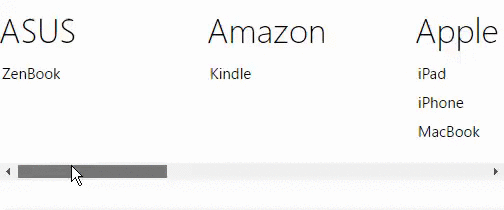</kbd>

```html
<body class="win-type-body">
    <div id="GroupHeader" data-win-control="WinJS.Binding.Template">
        <div data-win-bind="innerText: vendor"></div>
    </div>
    <div id="product" data-win-control="WinJS.Binding.Template">
        <div data-win-bind="innerText:name" style="width:128px;"></div>
    </div>
    <div id="lvProducts" style="height: 180px;" data-win-control="WinJS.UI.ListView"
        data-win-options="{ itemTemplate: select('#product'), 
                          groupHeaderTemplate: select('#GroupHeader'),
                          itemDataSource: SampleData.Products.dataSource }">
    </div>
    <script>
        (function () {
            'use strict';
            var products = W.bndLstNew([{ id: 1, name: "iPad", vendor: "Apple" },
                    { id: 2, name: "iPhone", vendor: "Apple" },
                    { id: 3, name: "Kindle", vendor: "Amazon" },
                    { id: 4, name: "Xbox", vendor: "Microsoft" },
                    { id: 5, name: "PlayStation", vendor: "Sony" },
                    { id: 6, name: "Galaxy", vendor: "Samsung" },
                    { id: 7, name: "MacBook", vendor: "Apple" },
                    { id: 8, name: "ZenBook", vendor: "ASUS" },
                    { id: 9, name: "Core i7", vendor: "Intel" },
                    { id: 10, name: "GeForce", vendor: "NVIDIA"}]),
                listControl1;
            W.nsDef("SampleData", {
                Products: products
            });
            W.uiCtrlRender(function () {
                W.uiCtrlGet("lvProducts", function (listView1) {
                    W.uiCtrlLstGrp(listView1, SampleData.Products, "vendor");
                });
            });
        }());
    </script>
</body>
```

#### Example of viewing data at two different zoom levels: ####

<kbd>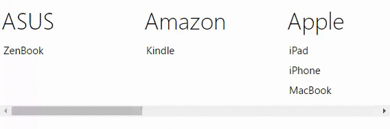</kbd>

```html
<body class="win-type-body">        
    <div id="GroupHeader" data-win-control="WinJS.Binding.Template">
        <div data-win-bind="innerText: vendor"></div>
    </div>

    <div id="ProductTemplate" data-win-control="WinJS.Binding.Template">
        <div data-win-bind="innerText:name" style="width:128px;"></div>
    </div>

    <!-- Zoom out-->
    <div id="VendorTemplate" data-win-control="WinJS.Binding.Template">
        <div data-win-bind="innerText: vendor" style="width:128px;"></div>
    </div>

    <div data-win-control="WinJS.UI.SemanticZoom" style="height:170px;">
        <!-- Zoom In-->
        <div id="lvProducts" data-win-control="WinJS.UI.ListView"
            data-win-options="{ itemTemplate: select('#ProductTemplate'), 
                                groupHeaderTemplate: select('#GroupHeader'),
                                itemDataSource: SampleData.Products.dataSource }">
        </div>

        <!-- Zoom Out-->
        <div id="lvVendors" data-win-control="WinJS.UI.ListView"
            data-win-options="{ itemTemplate: select('#VendorTemplate')}">
        </div>
    </div>

    <script>
        (function () {
            'use strict';
            var products = W.bndLstNew([{ id: 1, name: "iPad", vendor: "Apple" },
                { id: 2, name: "iPhone", vendor: "Apple" },
                { id: 3, name: "Kindle", vendor: "Amazon" },
                { id: 4, name: "Xbox", vendor: "Microsoft" },
                { id: 5, name: "PlayStation", vendor: "Sony" },
                { id: 6, name: "Galaxy", vendor: "Samsung" },
                { id: 7, name: "MacBook", vendor: "Apple" },
                { id: 8, name: "ZenBook", vendor: "ASUS" },
                { id: 9, name: "Core i7", vendor: "Intel" },
                { id: 10, name: "GeForce", vendor: "NVIDIA" }]);
            W.nsDef("SampleData", {
                Products: products
            });
            W.uiCtrlRender(function () {
                W.uiCtrlLstZoom(W.uiCtrlGet("lvProducts"), W.uiCtrlGet("lvVendors"), SampleData.Products, "vendor");
            });
        }());
    </script>
</body>
```

#### Example of placing commands in the appbar: ####

<kbd>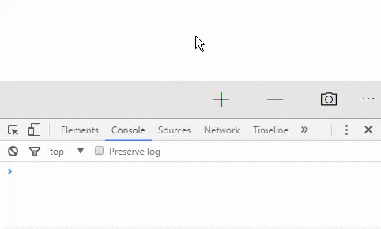</kbd>

```html
<body class="win-type-body">
    <div id="appBar">
        <button id="cmdAdd"></button>
        <button id="cmdRemove"></button>
        <button id="cmdCamera"></button>
    </div>
    <script>
        (function () {
            'use strict';

            function addMethod() { console.log("Add button pressed"); }
            function remMethod() { console.log("Remove button pressed"); }
            function camMethod() { console.log("Camera button pressed"); }

            var cmdAdd = W.uiCtrlBarCmdNew('cmdAdd', 'Add', 'add', addMethod),
                cmdRem = W.uiCtrlBarCmdNew('cmdRemove', 'Remove', 'remove', remMethod),
                cmdCam = W.uiCtrlBarCmdNew('cmdCamera', 'Click Photo', 'camera', camMethod),
                appBar = W.uiCtrlBarNew('appBar');

            W.uiCtrlRender();
        }());
    </script>
</body>
```

#### Example of placing commands in the toolbar: ####

<kbd>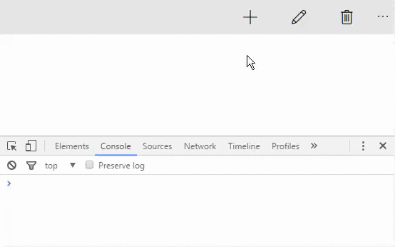</kbd>

```html
<body class="win-type-body">
    <div class="basicToolbar" id="tb">
        <!-- Primary commands -->
        <button id="cmdAdd"></button>
        <button id="cmdEdit"></button>
        <button id="cmdDelete"></button>
        <!-- Secondary command -->
        <button id="cmdShare"></button>
    </div>
    <script>
        (function () {
            'use strict';    
            W.nsDef("samples", {
                clickcommand: function (ev) {
                    var command = ev.currentTarget;
                    if (command.winControl) {
                        console.log(command.winControl.label);
                    }
                }
            });    
            var cmdAdd = W.uiCmdNew('cmdAdd', 'Add', 'primary', 'button', 'add', samples.clickcommand),
                cmdEdit = W.uiCmdNew('cmdEdit', 'Edit', 'primary', 'button', 'edit', samples.clickcommand),
                cmdDelete = W.uiCmdNew('cmdDelete', 'Delete', 'primary', 'button', 'delete', samples.clickcommand),
                cmdShare = W.uiCmdNew('cmdShare', 'Share', 'secondary', 'button', null, samples.clickcommand),
                toolbar = W.uiCtrlTbNew('tb');
        }());
    </script>
</body>
```

### Network ###

#### Example of Connecting to URL: ####

<kbd>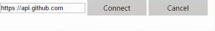</kbd>

```html
<body>        
    <div>
        <input id="inputurl" value="https:     * api.github.com" />
        <button class="action win-button" id="connect" type="button">Connect</button>
        <button class="action win-button" id="cancel" type="button">Cancel</button>
    </div>        
    <div id="output"></div>
    <script>
        (function () {
            'use strict';
            var input = document.getElementById("inputurl"),
                cancelBtn = document.getElementById("cancel"),
                connectBtn = document.getElementById("connect"),
                xhrPromise;
            function connect(url) {
                var resultDiv = document.getElementById("output");
                xhrPromise = W.netUrlConnect(url, function (result, status) {
                    if (result.status === 200) {
                        resultDiv.style.backgroundColor = "Green";
                        resultDiv.innerText = "Success";
                    }
                }, function (e) {
                    resultDiv.style.backgroundColor = "red";
                    resultDiv.innerText = e.statusText;
                });
            }
            W.evtHndAdd(input, "change", function (e) {
                connect(e.target.value);
            });
            W.evtHndAdd(cancelBtn, "click", function () {
                xhrPromise.cancel();
            }, false);
            W.evtHndAdd(connectBtn, "click", function () {
                connect(input.value);
            }, false);
        }());
    </script>
</body>
```